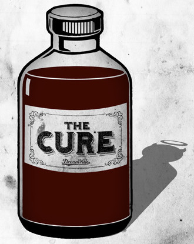

  <picture>
    <source media="(prefers-color-scheme: dark)" srcset="cure.jpg">
    <source media="(prefers-color-scheme: light)" srcset="cure.jpg">
    
  </picture>

<!-- [Website][Rust] | [Getting started] | [Learn] | [Documentation] | [Contributing] -->

CURE (acronym for **C**allable **U**nits **R**ecursive **E**valuator) is a high-level, dynamically-typed, functional programming language, capable of implementing object-oriented features, with support for procedural programming.

The whole programming language is build around only a single syntax: `[return-type] name(parameter-list) : initializer-list [=>] {executable logic}`. Omitting parts of this universal syntax changes the behaviour of the construct which the compiler understands to implement the desired behavioural logic.
